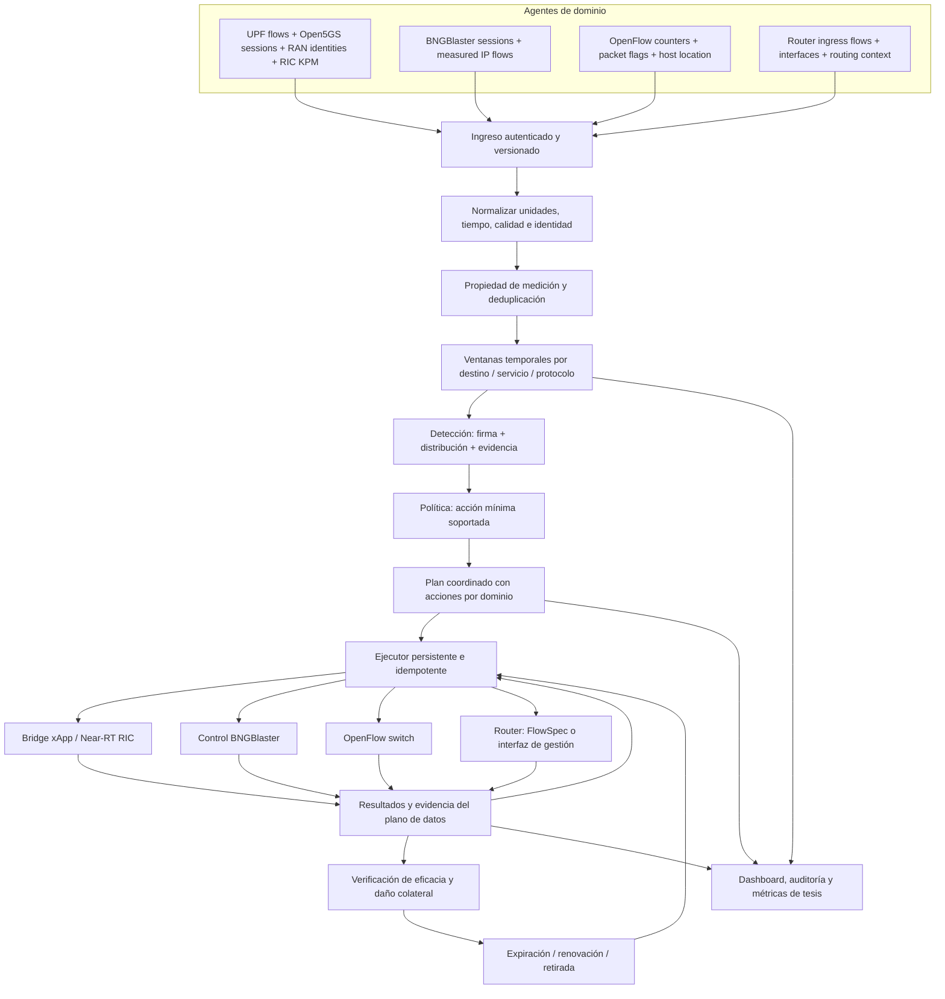
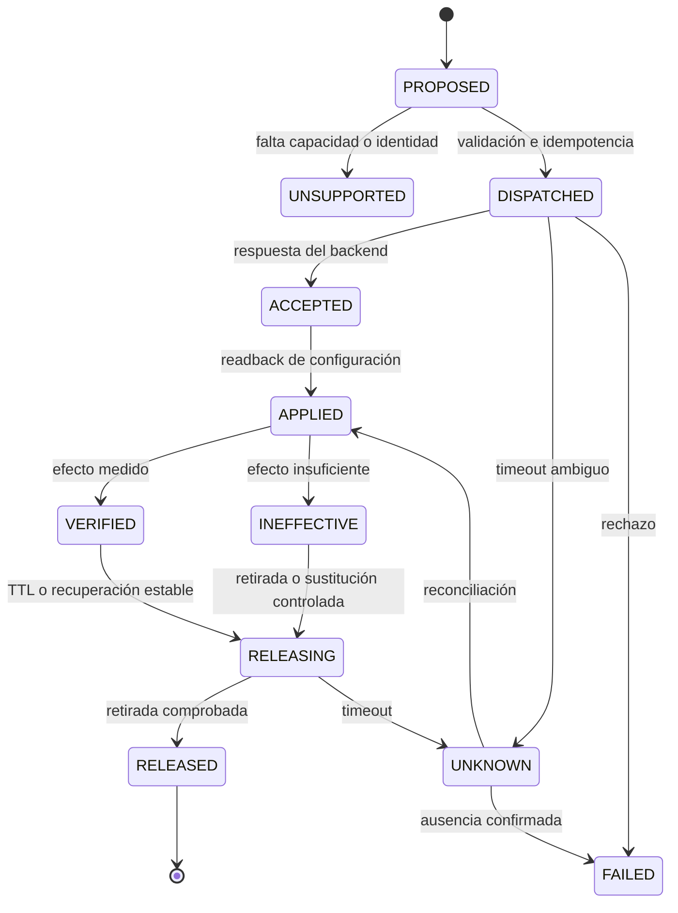

# Diseño de implementación completa del orquestador SP

Estado: diseño propuesto; no representa capacidades ya implementadas ni validadas.
Alcance: DoS/DDoS TCP SYN, UDP e ICMP floods en móvil O-RAN, fijo BNGBlaster,
Enterprise OpenFlow y peering BGP, incluyendo coordinación multidominio.
El simulador móvil retirado no se reintroduce. BNGBlaster permanece como entorno
experimental del dominio fijo. Fecha de revisión: 2026-09-09.

## 1. Arquitectura objetivo

Separar dos ciclos: adquisición/detección periódica y ejecución asíncrona de
control. Una llamada lenta al RIC/router no debe bloquear la adquisición.

## 2. Contratos comunes

Evolucionar `core/mobile_models.py` a contratos compartidos en `core/observations.py`;
mantener adaptadores de compatibilidad para `TelemetryEvent` mientras se migran
los detectores. No renombrar silenciosamente `bps`: actualmente significa bytes/s.
Usar nombres explícitos `bytes_per_second` y `bits_per_second` en el nuevo contrato.

### ObservationEnvelope

Campos: schema_version, agent_id, source_id, boot_id, sequence, observation_id,
observed_start, observed_end, received_at, origin_domain, observation_domain,
network_id/VRF, observation_point, direction, ownership_id, quality y payload.
source_id identifica el punto de medición; origin_domain identifica el acceso de
la fuente; observation_domain identifica dónde fue visto. No confundirlos.
quality incluye sampling_rate, estimated, clock_uncertainty y cobertura.

### FlowObservation v2

IPs y puertos origen/destino, protocolo IP, bytes_delta, packets_delta,
syn_without_ack_delta opcional, synack_delta opcional, icmp_type/code opcionales,
interfaz de entrada/salida y ventana. Los indicadores ausentes son null, no cero.
Los flags OR-ed de un registro de flujo no equivalen a número de paquetes SYN.
No clasificar todo TCP como SYN. KPM no proporciona esta evidencia por sí solo.

### IdentityBinding

network_id, dominio de origen, access_id, IP, inicio/fin de validez, provenance,
versión y lease/expiry del snapshot. Campos específicos: SUPI/sesión PDU,
UEID tipado, nodo E2 tipado, celda, sesión BNG/VLAN o ubicación switch/puerto.
Los identificadores son cadenas. Una asociación ambigua no habilita control por UE.
Si un flujo cruza una reasignación, no atribuir el intervalo completo: dividirlo
solo con evidencia temporal del productor o conservar identidad desconocida.

### KpmObservation

Conservar alcance nodo/celda/UE, identidad explícita, nombre, unidad, valor,
status, reliable, timestamp original y período de medición. Node ID no es Cell ID.
Normalizar unidades conocidas; no convertir volúmenes en tasas sin semántica de
contador e intervalo comprobados. Rechazar valores no finitos. NO_VALUE sigue null.

### DetectionResult v2

incident_id, ventana, destino/servicio, attack_vector={TCP_SYN,UDP,ICMP,MIXED},
distribution={SINGLE_SOURCE,DISTRIBUTED}, origin_domains, fuentes e identidades,
evidence_ids, tasas, umbrales, confidence, attribution_quality y coverage_status.
Mantener vector y distribución separados: DDoS no debe borrar la firma TCP/UDP/ICMP.
Sin identidad suficiente, reportar distribución por fuentes observadas; una IP
no demuestra por sí sola un atacante físico, particularmente con NAT/spoofing.

### MitigationIntent / Result

Intent: command_id, incident_id, idempotency_key, dominio, destino de control,
selector tipado (flujo/UE/sesión/prefijo), action, parámetros, expires_at,
expected_identity_version, capability_version y motivo/evidencia.
Result: command_id, estado, timestamps, backend_reference, error_code, detalle,
config_readback y evidence_ids. No usar un bool como confirmación final.

## 3. Adquisición, correlación y detección

Propuesta inicial configurable: ventanas de 5 s con paso de 1 s, lateness de 2 s
y timeout de fuente de 3 intervalos. Son valores de arranque, no resultados de
calibración. Una ventana incompleta se marca como tal; ausencia de datos no es
tráfico cero ni autorización de desbloqueo. No contar ventanas solapadas como
muestras estadísticas independientes al evaluar la tesis.

Un ingreso HTTP JSON versionado recibirá lotes; agentes autentican mediante mTLS
o token protegido según despliegue. Validar tamaño, schema, números, rangos,
reloj y origen. Cada agente guarda una cola acotada para reintentos con IDs estables.
Exponer /health y /capabilities separados de la disponibilidad de datos.
Mantener el snapshot móvil existente como transporte local inicial, con el mismo
contenido semántico; no duplicar ambos transportes en una misma ejecución.

Deduplicación en dos niveles:
1. Reentrega: (agent_id, boot_id, observation_id), con retención superior a la
   ventana máxima de reintento del agente.
2. Múltiples observadores: registro de ownership que elige un punto autoritativo
   por segmento/tráfico/dirección. Copias de tránsito solo aportan corroboración.
   No deduplicar ciegamente por 5-tupla: pueden existir intervalos distintos.

El acceso asigna el dominio de origen. Ver una UE en el router de borde no añade
Peering como segundo origen. Peering significa tráfico entrante desde ese acceso.
Agrupar por network_id y destino, luego servicio/protocolo. Mantener un nivel
superior por destino para ataques mixtos. No mezclar direcciones UL/DL.

TCP SYN: usar tasa de SYN sin ACK; relación con respuestas y conexiones completas
solo cuando su cobertura sea suficiente. UDP e ICMP: tasas medidas, composición,
persistencia y desviación de baseline. DDoS: acumulación de fuentes distintas,
incluso bajo umbral individual. Multidominio: al menos dos dominios de origen
independientes con evidencia coincidente. Umbrales por dominio/vector/capacidad,
histéresis y baseline limpio. Congestión KPM sola produce alerta de recurso.
El clasificador y la política no deben descartar ataques simultáneos por elegir
un único ganador global; evaluar cada incidente y selector de forma independiente.

## 4. Implementación por dominio

### Móvil O-RAN

Datos: colector del plano de usuario antes de NAT para IP/paquetes/SYN; exportador
Open5GS para SUPI/PDU/IP y ciclo de vida; exportador CU-CP para correlacionar
NGAP con F1AP/E1AP y celda; lector Gateway para KPM originales.
No deducir la relación NGAP↔F1AP a partir de igualdad numérica o una única UE.
KPM agregado sirve de contexto desde fase inicial. KPM por UE se incorpora solo
tras verificar ID y decodificación; la clasificación IP no depende de Format 5.

Control: implementar un bridge xApp que reciba MitigationIntent y traduzca a
operaciones E2SM-RC realmente soportadas, con ACK/FAILURE, readback y medición.
No existe garantía de que el stack permita bloquear una 5-tupla o limitar UL por
UE. Es obligatorio inspeccionar RANFunctionDefinition, código y prueba de control
antes de elegir operación. La documentación srsRAN describe RC Style 2; esto no
prueba una acción de throttle en el build desplegado [1].

Puerta de aceptación: demostrar una operación RIC que reduzca el tráfico de la
UE seleccionada sin afectar otra UE. Si no existe, desarrollar el control en
xApp y agente E2/scheduler, o elegir un backend RAN compatible. Filtrar en UPF
puede ser contingencia, pero NO cumple por sí solo el requisito de control vía RIC.

### Fijo BNGBlaster

Conservar pipeline existente, comprobar granularidad por sesión y destino.
Si sus estadísticas no distinguen protocolos/flags/destinos, complementar con un
colector del plano de datos; una sesión con varios destinos no es un único flujo.
Relacionar session_id/IP/VLAN con validez temporal. No tomar el nombre del escenario
lanzado como prueba de que el detector identificó el ataque.

Control experimental: comandos de sesión BNGBlaster, consulta posterior de estado
y verificación de caída de tráfico. Una baja de sesión es mitigación de acceso
emulada y puede interrumpir todo el tráfico de esa sesión. Mostrar ese alcance.
No presentarla como filtrado selectivo realizado por un BNG de producción.
Si se exige filtrado en BNG, agregar ese elemento de enforcement al testbed.

### Enterprise OpenFlow

Conservar colecciones y ubicación de hosts. Obtener contadores SYN reales mediante
reglas compatibles o colector de paquetes; estadísticas TCP agregadas no bastan.
Evitar sumar el mismo tráfico por PacketIn y FlowStats. Aplicar drop o meter solo
si están anunciados por el switch; cookie por acción y selector preciso.
BarrierReply ordena operaciones pero no demuestra eficacia: consultar reglas,
errores y contadores. Retirar por cookie propia y verificar eliminación.

### Peering BGP

Implementar colector IPFIX/NetFlow o captura dirigida en ingress del borde, más
contexto de interfaces/vecinos/rutas. BMP es contexto de rutas, no flujo IP.
Si el exportador muestrea, conservar sampling_rate y evaluar el sesgo; preferir
contadores no muestreados para la validación de laboratorio y firma SYN.

Control preferido: FlowSpec si el router instala sus reglas en el plano de datos,
con selectores origen/destino/protocolo/puertos admitidos [2]. El speaker por sí
solo no es un router de filtrado. Si no hay soporte, usar ACL/policer mediante la
API de gestión del router y declarar el mecanismo utilizado.
RTBH queda como política explícita de último recurso sobre destino: sacrifica
su conectividad. No anunciar la IP del atacante esperando filtrado de origen;
la comunidad BLACKHOLE expresa descarte hacia el prefijo anunciado [3].
Comprobar aceptación, instalación y contadores; retirar anuncios/reglas al expirar.

## 5. Ejecución y consistencia

Guardar incidentes, acciones y transiciones en SQLite inicialmente, con WAL,
transacciones y un único dueño de escritura. Registrar antes de enviar. Reintentar
con la misma clave; no duplicar reglas tras timeout. Al reiniciar, reconciliar
estado persistido con el backend. TTL debe tener implementación comprobada:
expiración nativa o watchdog independiente; no confiar solo en un timer del proceso.

Un plan multidominio contiene acciones independientes por fuente y dominio;
ejecutarlas en paralelo con límites por backend. Estado agregado: pendiente,
parcial, aplicado o verificado según resultados individuales. No existe una
transacción atómica entre RIC, BNG, switches y router. Mantener acciones eficaces
si otro dominio falla, registrar cobertura parcial y evitar rollback global ciego.
Antes de ejecutar/reintentar/renovar comprobar que la identidad aún es válida.

Corrección prioritaria actual: `_dispatch`, `force_unblock` y desbloqueos móviles
no deben registrar éxito al ignorar el resultado del adaptador. Dashboard separa
acciones propuestas, aceptadas, aplicadas y verificadas. Un ACK no es eficacia.

## 6. Módulos y orden de entrega

| Fase | Cambios propuestos | Criterio de salida |
|---|---|---|
| A: control honesto | core/control_models.py; orchestration/executor.py; corregir _dispatch y UI | Fallo/timeout jamás aparece como bloqueo aplicado |
| B: contrato y propiedad | core/observations.py; telemetry/ingestion.py; correlation/windows.py y ownership.py | Reentregas y doble observación no aumentan volumen |
| C: móvil datos | collectors/upf_flows.py; session exporter en core; RAN identity exporter; telemetry/ric_kpm_adapter.py | Flujos reales unidos a sesiones y KPM sin inferencias falsas |
| D: fijo y enterprise | adaptar colectores existentes al contrato; resultados backend verificables | Tres firmas detectadas y mitigadas con evidencia |
| E: peering | colector ingress; telemetry/bgp_adapter.py; mitigation/peering_backend.py | Router instala y retira política; efecto medido |
| F: móvil control | bridge xApp + backend RC y, si hace falta, extensión E2/RAN | Acción por UE vía RIC demostrada con segunda UE de control |
| G: integración | detección multidominio, planes, recuperación y métricas | Matriz experimental completa |

C y la investigación de capacidades de E/F pueden comenzar en paralelo a A/B.
No declarar fase G completa mientras un dominio solo tenga un stub. Los nombres
nuevos son propuestos; aún no son archivos implementados.

## 7. Pruebas y métricas de aceptación

Matriz mínima: 4 dominios × 3 firmas × {DoS, DDoS} = 24 casos básicos, con baseline
benigno y recuperación. Añadir las 6 parejas de dominios por firma (18 casos),
un ataque de cuatro dominios por firma (3) y un ataque mixto de protocolos.
Las fuentes deben ser distintas y atribuibles; no usar IPs falsificadas como prueba
suficiente de múltiples UEs o sesiones.

Casos negativos: TCP legítimo de alto volumen, ráfagas benignas, datos retrasados,
contador reiniciado, fuente desconectada, IP reasignada, IDs ambiguos, observación
del mismo paquete en acceso y peering, backend no soportado, rechazo, timeout,
reinicio del orquestador, eliminación fallida y falla parcial multidominio.

Medir por ejecución: falsos positivos/negativos, precisión/recall por firma,
Td = detección − inicio de ataque conocido por evaluación,
Tdispatch, Tapply, Teffect, reducción de tráfico malicioso, pérdida/latencia del
tráfico benigno, recuperación y utilización CPU/memoria. Sincronizar relojes y
reportar incertidumbre; el ground truth de generación no entra al detector.

Protocolo de evaluación propuesto: calibrar con conjunto separado; fijar umbrales
antes de evaluar; mínimo 10 repeticiones por caso y reportar mediana, p95 y dispersión.
Objetivos iniciales a aprobar tras piloto: detección en dos ventanas completas,
reducción ≥90% en el punto protegido, pérdida adicional benigna ≤5 puntos
porcentuales cuando la acción es selectiva. La baja de sesión/RTBH debe reportar
su daño colateral explícito, no aprobarse como filtrado selectivo.
Siempre exigir: no éxitos falsos, no doble conteo, selector correcto y retirada
comprobada. Guardar configs, versiones, hashes, observaciones, decisiones,
respuestas y mediciones por run_id para reproducibilidad.

## 8. Decisiones de despliegue aún necesarias

- Router de peering, versión, exportador y capacidad efectiva de FlowSpec/ACL.
- Operación RC disponible y punto RAN donde se aplicará la mitigación por UE.
- Interfaz/versiones Open5GS y ruta de exportación de sesiones activas.
- Punto UPF antes de NAT y reglas de ownership respecto a OVS/peering.
- Si el alcance fijo acepta detener sesiones BNGBlaster como mitigación emulada.
- Presupuesto de latencia y límites de daño colateral exigidos en la tesis.

Estas decisiones condicionan conectores concretos; no impiden implementar A/B.

## Referencias y límites de evidencia

[1] [srsRAN: O-RAN NearRT-RIC y xApp](https://docs.srsran.com/projects/project/en/latest/tutorials/source/near-rt-ric/source/index.html).
La documentación general describe capacidades, no certifica el fork del testbed.

[2] [RFC 8955: Flow Specification](https://www.ietf.org/rfc/rfc8955.html).

[3] [RFC 7999: BLACKHOLE Community](https://www.rfc-editor.org/rfc/rfc7999.html).

La investigación previa identificó un fallo de unpack de Action Definition y
problemas de manejo de fallos/timeouts en FlexRIC. No demostró una incompatibilidad
ASN.1 exacta ni inviabilidad general de KPM por UE. No usar esas hipótesis como
conclusiones experimentales en la tesis.
