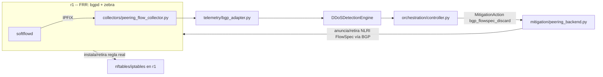

# Plan de instrumentación — Dominio Peering BGP (Fase E)

Estado: plan aprobado, sin implementar. Referencia: [Diseño de implementación](implementation-design.md)
sección "Peering BGP" y fase E de la tabla de módulos. Fecha: 2026-09-10.

## 1. Alcance y decisiones de despliegue confirmadas

Estas eran las "decisiones de despliegue aún necesarias" de `implementation-design.md` §8,
ya resueltas para este dominio:

| Decisión | Resuelto como | Nota |
|---|---|---|
| Software BGP en el router (`r1`) | **FRR** (`bgpd` + `zebra`) | Necesario porque debe *instalar* la política en el plano de datos, no solo hablar BGP. Un speaker puro (ExaBGP/GoBGP) no basta por sí solo en este escenario de un único router Linux. |
| Telemetría de ingreso | **IPFIX real vía `softflowd`** | Más fiel a un borde SP real que nftables; introduce una herramienta nueva al proyecto. |
| Mecanismo de mitigación | **FlowSpec desde el inicio** (no RTBH primero) | Ver riesgo técnico en §2 — requiere validación antes de construir el pipeline completo. |
| Contrato de datos | **`TelemetryEvent`/`MitigationAction` actuales** | No se adelanta la Fase B (`core/observations.py`); si esa fase avanza, peering migra junto con los demás dominios, no antes. |
| Acción de mitigación | **`bgp_flowspec_discard` reemplaza a `bgp_blackhole`** | Simplifica a una sola acción de peering por ahora. RTBH queda fuera de alcance de esta fase (ver §6, riesgo). |

## 2. Riesgo técnico a validar primero (spike, antes de construir el pipeline)

El soporte de FRR para traducir una ruta BGP FlowSpec recibida en una regla real de
`iptables`/`ipset` (vía su integración PBR) es una característica relativamente reciente y
menos madura que el BGP básico. Por diseño de FRR, la ruta debe venir de un speaker BGP
externo — "FRR is a FlowSpec client only"; no se puede inyectar por CLI. **No construir el
pipeline completo sin antes confirmar esto**, siguiendo la misma disciplina que exige
`thesis-revision-plan.md` (capacidad declarada vs. capacidad comprobada en el build
desplegado).

**Spike automatizado:** `deploy/spike_flowspec_frr.sh` (requiere haber corrido
`deploy/install_bgp_peering.sh` primero). Corre FRR y `exabgp` sobre loopback en la propia
VM (desacoplado de la topología Mininet a propósito — primero se valida la capacidad del
software, luego se conecta a `r1`), configura `bgpd` con `address-family ipv4 flowspec`,
levanta `exabgp` como el otro extremo BGP, anuncia una ruta FlowSpec de descarte real vía
su FIFO, y verifica con `show pbr ipset`/`show pbr iptable` y `iptables -S`/`ipset list`
si la regla llegó al plano de datos — no solo que aparece en `show bgp ipv4 flowspec`.
Imprime PASS/FAIL explícito al final. `sudo ./deploy/spike_flowspec_frr.sh --cleanup` revierte
la configuración de prueba.

**Si el spike falla:** FlowSpec queda documentado como capacidad no comprobada en este
build de FRR, y el plan cae a RTBH (`bgp_blackhole` original) como mecanismo de mitigación
real para esta fase, dejando FlowSpec como trabajo futuro — exactamente la distinción que
pide el capítulo IV revisado. No proceder con la implementación de `peering_backend.py`
orientada a FlowSpec hasta tener este resultado.

## 3. Módulos nuevos y su responsabilidad

| Módulo | Responsabilidad | Notas de implementación |
|---|---|---|
| `collectors/peering_flow_collector.py` (nuevo) | Recibir/parsear registros IPFIX de `softflowd` y producir eventos por flujo (src/dst/proto/puerto/bytes/paquetes). | **No reutiliza** `collectors/flow_collector.py` — ese colector está atado al formato de FlowStats de OpenFlow/Ryu. Necesita su propio parser IPFIX (evaluar librería: `ipfix`, `pyflowkit`, o parseo directo del formato). |
| `telemetry/bgp_adapter.py` (reemplaza el stub) | `collect()` lee del colector anterior y produce `TelemetryEvent` con `domain="bgp"`. `is_connected()` verifica sesión BGP activa con `r1` (vía el backend de mitigación, ver abajo) y/o que `softflowd` esté exportando. | Mantiene la forma actual de `DomainAdapter`; no cambia de contrato. |
| `mitigation/peering_backend.py` (nuevo) | Actúa como BGP speaker: origina/retira rutas FlowSpec hacia `r1` vía una sesión BGP (probablemente iBGP, todo dentro del mismo testbed). Traduce `MitigationAction(action="bgp_flowspec_discard")` → NLRI FlowSpec (match dst/proto/puerto, acción descarte) y su retiro al expirar TTL. | Evaluar librería BGP en Python para originar FlowSpec (candidatas: `exabgp` como proceso controlado vía su API JSON/pipe; librerías BGP nativas si soportan NLRI FlowSpec de forma práctica). `telemetry/bgp_adapter.py.apply_mitigation()` delega aquí. |

## 4. Cambios en código existente

- `orchestration/controller.py:629-633`, método `_action_for()`: cambiar
  `if domain == "bgp": return "bgp_blackhole"` → `return "bgp_flowspec_discard"`.
- `core/models.py:101`: actualizar el docstring de `MitigationAction.action` para reflejar
  `"block" | "rate_limit" | "bgp_flowspec_discard"` (retirando `bgp_blackhole`).
- `webtool/static/app.js:318` (`BLOCK_DOMAIN_LABELS`): ya tiene `bgp: "BGP"` — sin cambios
  necesarios, pero verificar que la UI de bloqueos activos muestre la acción correcta una
  vez que `bgp_flowspec_discard` empiece a aparecer en logs/estado real.
- `topologies/star_topology.py`: `r1` (`LinuxRouter`) necesita arrancar `bgpd`/`zebra` de
  FRR al inicializar la topología, en vez de solo `ip_forward=1`.

## 5. Orden de entrega

1. **Spike de validación FlowSpec en FRR** (§2) — decide si el resto del plan usa FlowSpec
   o cae a RTBH. Bloqueante para los pasos 3 y 4.
2. Instalar y configurar `softflowd` en la interfaz externa de `r1`; confirmar que exporta
   IPFIX visible con una herramienta de inspección simple (`nfcapd`/tcpdump del tráfico UDP
   de exportación) antes de escribir el parser en Python.
3. `collectors/peering_flow_collector.py` + `telemetry/bgp_adapter.py` (telemetría real,
   sin mitigación todavía) — validar que el detection engine ve tráfico de peering real.
4. FRR completo en `r1` + `mitigation/peering_backend.py` (mitigación real) — validar que
   una ruta FlowSpec anunciada aparece como regla real y efectivamente descarta tráfico.
5. Actualizar los 3 puntos de código existente (§4) y el webtool.
6. Escenario de ataque end-to-end contra el dominio peering (uno de los "24 casos básicos"
   de la matriz de `thesis-revision-plan.md`), con medición de Td/Tdispatch/Tapply/Tefecto.

## 6. Criterio de salida de la fase (igual al de `implementation-design.md` §6)

**"Router instala y retira política; efecto medido."** No declarar la fase E completa si:
- FlowSpec no llegó a instalarse realmente en el plano de datos (queda como RTBH, documentado como tal).
- El colector IPFIX produce eventos pero nunca se validó contra una captura de referencia.
- La retirada de la ruta al expirar el TTL no se comprobó explícitamente (no asumir por ausencia de errores).
