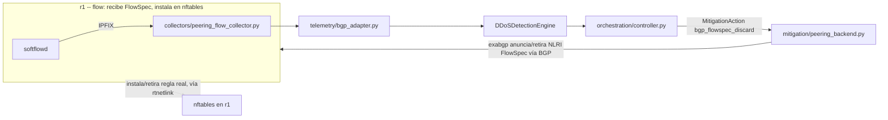

# Plan de instrumentación — Dominio Peering BGP (Fase E)

Estado: **mecanismo de mitigación confirmado de punta a punta, incluida la topología Mininet
real (§5) — FRR descartado, `flow` validado.** Pendiente: telemetría IPFIX real (§5 pasos 2-3)
y medición de efecto/TTL (§6). Referencia:
[Diseño de implementación](implementation-design.md) sección "Peering BGP" y fase E de la
tabla de módulos. Fecha: 2026-09-10/11.

## 1. Alcance y decisiones de despliegue confirmadas

Estas eran las "decisiones de despliegue aún necesarias" de `implementation-design.md` §8,
ya resueltas para este dominio:

| Decisión | Resuelto como | Nota |
|---|---|---|
| Software que instala FlowSpec en el plano de datos (en `r1`) | **[`flow`](https://github.com/hack3ric/flow)** (no FRR — ver §2) | FRR nunca fue capaz de instalar la ruta FlowSpec recibida como regla real de `nftables`/`iptables`; es un hueco conocido y sin resolver en FRR mainline desde 2019 ([FRRouting/frr#3160](https://github.com/FRRouting/frr/issues/3160)). `flow` sí lo hace — confirmado con evidencia real, ver §2. |
| Speaker BGP del lado del controlador | **`exabgp`**, vía su FIFO de comandos | Sin cambios respecto al diseño original — `exabgp` habla BGP con `flow`, no con FRR. |
| Telemetría de ingreso | **IPFIX real vía `softflowd`** | Más fiel a un borde SP real que nftables; introduce una herramienta nueva al proyecto. |
| Mecanismo de mitigación | **FlowSpec** (confirmado viable, ver §2) | Ya no es una apuesta — se validó con una regla real instalada en `nftables`. |
| Contrato de datos | **`TelemetryEvent`/`MitigationAction` actuales** | No se adelanta la Fase B (`core/observations.py`); si esa fase avanza, peering migra junto con los demás dominios, no antes. |
| Acción de mitigación | **`bgp_flowspec_discard` reemplaza a `bgp_blackhole`** | Simplifica a una sola acción de peering por ahora. RTBH queda fuera de alcance de esta fase. |

## 2. Spike de FlowSpec — resultado final: FRR falla, `flow` funciona

El soporte de traducir una ruta BGP FlowSpec recibida en una regla real de `nftables`/`iptables`
es una característica relativamente reciente y menos madura que el BGP básico — exactamente
el tipo de capacidad que `thesis-revision-plan.md` exige comprobar en el build desplegado,
no asumir de la documentación general. Se probaron dos rutas.

### 2.1. FRR — FAIL, causa raíz confirmada y documentada

`deploy/spike_flowspec_frr.sh` (conservado en el repo como evidencia negativa documentada,
no como script de despliegue) intentó validar `bgpd` + `zebra` de FRR como instalador. En el
camino se encontraron y resolvieron **cuatro problemas reales, independientes entre sí**,
antes de llegar a la causa raíz final:

1. **FRR prohíbe peering con `127.0.0.0/8` por diseño.** Un mantenedor de FRR lo confirma en
   [discusión #11375](https://github.com/FRRouting/frr/discussions/11375): *"we don't allow
   peering with 0.0.0.0/127.0.0.0/240.0.0.0 as they are treated as invalid ranges"*. Ningún
   ajuste de configuración lo evita.
2. **FRR también rechaza peering con cualquier IP local del mismo namespace de red**
   (`% Can not configure the local system as neighbor`), incluso usando un par `veth` con IPs
   no-loopback — hace falta aislar un extremo en su propio *network namespace* para que FRR
   lo trate como un sistema genuinamente distinto.
3. **`bgp ebgp-requires-policy` (cumplimiento de RFC 8212)** descarta silenciosamente todas
   las rutas entrantes de un vecino eBGP sin política explícita — la sesión se establece pero
   `show bgp ipv4 flowspec` muestra 0 rutas.
4. **La configuración de `bgpd` armada por `vtysh` no persiste** entre reinicios de `frr` sin
   `write memory` — un reinicio (necesario para activar el daemon `pbrd`) la borró por completo.

Superados los cuatro, la ruta SÍ llegó a la RIB de FlowSpec (`show bgp ipv4 flowspec`) y
`show pbr ipset`/`show pbr iptable` (la vista *interna* de FRR) mostraban el objeto de la
regla correctamente armado. Pero el sistema real (`iptables -S`, `ipset list`) nunca mostró
nada, con o sin `pbrd` habilitado. Causa raíz, confirmada por un mantenedor de FRR en
[FRRouting/frr#3160](https://github.com/FRRouting/frr/issues/3160) (abierto en 2019, **sin
resolver** a la fecha, reportado también en 7.0, 7.5.1, 8.1.0 y 8.4.2):

> **pguibert6WIND** (mantenedor, FRR/6WIND): *"the PBR install requires FRR to contain a
> plugin that is not yet in FRR main stream"* ... *"we have to go to a real ABI (application
> BINARY interface), if someone is willing to do it."*

Es decir: el puente FlowSpec→PBR→kernel de FRR construye el objeto de la regla en memoria,
pero el código que lo empujaría al kernel real **nunca se integró a la rama principal**. No
es un error de configuración nuestro ni algo que un spike más largo fuera a resolver.

### 2.2. `flow` — PASS, confirmado con evidencia real

[`hack3ric/flow`](https://github.com/hack3ric/flow) no es un router BGP completo — es un
*sink* que recibe una sesión BGP de otro speaker (en nuestro caso, `exabgp`) y traduce las
rutas FlowSpec recibidas en reglas `nftables` reales vía `rtnetlink(7)`. Es exactamente el
puente que a FRR le falta. Instalación vía binario precompilado (`x86_64-unknown-linux-gnu`,
sin necesidad de compilar Rust — ver `deploy/install_bgp_peering.sh`).

A diferencia de FRR, `flow` no tiene ninguna de las cuatro restricciones de la sección 2.1:
es pasivo por diseño (nunca inicia la sesión, evitando colisiones), y su propio ejemplo de
uso oficial ya empareja sobre loopback (`::1`) sin problema. La sesión `exabgp` ↔ `flow` se
estableció **al primer intento**, sin ningún ajuste especial.

Ruta de prueba: `announce flow route { match { destination 198.51.100.99/32; protocol tcp;
destination-port =80; } then { discard; } }` vía el FIFO de `exabgp`. Resultado, verificado
directamente en el sistema (no en la vista interna de una herramienta):

```
$ sudo ip netns exec exabgp-ns nft list ruleset
table inet flowspecs {
        chain flowspecs {
                ip daddr 198.51.100.99 meta l4proto { tcp } th dport { 80 } drop comment "0"
        }
}
```

Regla real, en `nftables`, instalada automáticamente a partir de la ruta BGP FlowSpec
anunciada. **Esto es la prueba de capacidad que exige `implementation-design.md` §5** (más
allá de ACCEPTED/DISPATCHED — esto es una instalación real verificada).

**Ciclo de retiro también confirmado.** Se probó `withdraw flow route { ... }` (mismo match)
sobre la misma sesión: `flow show` dejó de listar la ruta, y `nft list ruleset` volvió a
mostrar la cadena `flowspecs` vacía — la regla real fue removida, no solo desasociada de la
vista de `flow`. El ciclo completo announce→instalación→withdraw→remoción queda confirmado
de punta a punta. Automatizado en `deploy/spike_flowspec_flow.sh` (pasos 7-8). Lo único que
sigue pendiente es la medición de *efecto* sobre tráfico real y la integración con `r1`/la
topología Mininet (ver §5/§6).

**Honestidad a mantener en la tesis:** `flow` es una herramienta joven y su propio README lo
advierte — *"has yet to be tested thoroughly and not suitable for production for now"* (30
estrellas, mantenedor único). Válida y documentada como tal para un testbed de laboratorio;
no presentar como una solución de nivel productivo.

Reproducible con `deploy/spike_flowspec_frr.sh` (documenta el FAIL, conservado como evidencia)
y el procedimiento de `flow` reproducido en `deploy/spike_flowspec_flow.sh` (documenta el PASS).

### 2.3. Telemetría (`peer_ext` → `softflowd` → `nfcapd` → `nfdump` → collector) — PASS

Confirmado de punta a punta en la VM (`validate_peering.py`, paso 6) el 2026-09-11, tras varias
rondas de debugging real que vale documentar porque cada una fue una causa raíz distinta, no
una sola:

1. **Un ping simple nunca llega a exportarse.** `softflowd` reportó "Flows: 0" incluso con
   ICMP real confirmado por `tcpdump` en la misma interfaz. `softflowctl statistics` aisló la
   causa: `Packets received by libpcap` > 0 pero `Packets processed: 0` — el *ring buffer* de
   captura de Linux (TPACKET_V3) solo entrega paquetes a `softflowd` cuando se llena un bloque
   completo, y `softflowd` no fija un *timeout* de lectura ni modo inmediato, así que un puñado
   de pings nunca dispara el volcado. La causa **no** es específica de ICMP ni de la versión de
   NetFlow (se descartó explícitamente probando v9 y v5 con el mismo resultado). El build de
   `softflowd` 1.0.0 de esta VM tampoco soporta `-B` (tamaño de buffer) para mitigarlo desde ahí.
   **Fix:** `validate_peering.py` genera tráfico real con `hping3 --icmp --flood` (mismo patrón
   ya usado en el dominio enterprise) en vez de un ping — volumen suficiente para llenar un
   bloque de inmediato, y además representa mejor lo que esta tubería existe para detectar.
2. **`collectors/peering_flow_collector.py` nunca lee el último archivo de `nfcapd`** por
   diseño (asume que `nfcapd` lo tiene abierto — correcto para el polling continuo del
   orchestrator en producción). En una prueba de una sola pasada, si solo ocurre una rotación
   antes de consultar al colector, el archivo con los datos reales queda excluido para siempre.
   **Fix:** esperar dos ciclos de rotación de `nfcapd`, no uno, antes de invocar `poll()`.
3. `nfdump -o csv` agrega un bloque `Summary` final con columnas distintas a las de un flujo
   real; `csv.DictReader` lo mapea por posición sobre el header original, dejando columnas más
   allá del ancho del resumen (como `ipkt`) en `None`, y `int(None)` lanza `TypeError` — no
   capturado por el `except (KeyError, ValueError)` existente. Nunca se había manifestado
   porque todo archivo de captura anterior estaba vacío ("No matched flows", sin bloque
   `Summary`). **Fix:** agregar `TypeError` al `except`.
4. Un `flow` matado con `pkill -9` durante la limpieza manual de la VM no alcanza a borrar su
   propio socket de control (nombre determinístico según IP:puerto de bind), y la siguiente
   corrida falla con `Address already in use`. **Fix:** `PeeringLifecycle.start()` limpia
   sockets viejos en `/run/flow/*.sock` antes de arrancar `flow`, igual que ya crea el FIFO de
   `exabgp` si no existe.

De paso, se agregó `PeeringLifecycle._ensure_alive()`: cada uno de los 4 subprocesos
(`flow`/`exabgp`/`nfcapd`/`softflowd`) se verifica vivo justo después de arrancar, y lanza una
excepción inmediata con el log si ya murió — antes, un flag de CLI rechazado (como el `-B` de
softflowd, no soportado en el build de esta VM) fallaba en silencio y solo se notaba varios
pasos después como "no hay datos de telemetría", sin ninguna pista de la causa real.

Adicionalmente se encontró y corrigió un segundo bug real vía las mismas pruebas: un `nfcapd`
matado con `pkill -9` (limpieza manual entre sesiones de prueba) deja su archivo
`nfcapd.current.<PID>` huérfano — nunca se renombra a su nombre final con timestamp porque eso
solo ocurre en una rotación limpia. Peor aún, `PeeringFlowCollector` arrancaba con
`_processed_files` vacío, así que el primer `poll()` de una sesión nueva del controlador leía
*todo* archivo `nfcapd.*` preexistente como si fuera tráfico en vivo — confirmado en la VM: al
arrancar el controlador (antes de que la topología, y por tanto `flow`/`exabgp`, existieran) se
disparó una detección y un intento de mitigación FlowSpec real usando datos de horas antes,
fallando al escribir al FIFO de exabgp (`ENXIO`, sin lector activo). **Fix:**
`PeeringFlowCollector.__init__` ahora siembra `_processed_files` con lo que ya exista en el
directorio al construirse — semántica "tail -f", no "leer todo el historial".

### 2.4. Limitación arquitectónica encontrada: el dominio `bgp` casi nunca "gana" la
representación en `detection/engine.py`

Al probar el dominio desde el webtool real (`peer_ext` atacando un host normal de la topología,
detrás de un switch), el log del controlador mostró la detección y mitigación etiquetadas como
`[enterprise]` (`DROP_RULE_INSTALLED ... scope=4 switch(es)`), **nunca** `[bgp]`
(`BGP_FLOWSPEC_DISCARD`) — pese a que la tubería de telemetría BGP (§2.3) sí capturó el mismo
tráfico real (confirmado revisando los archivos `nfcapd.*` generados durante la ventana del
ataque).

Causa raíz: `correlation/correlator.py` agrupa eventos de telemetría por `dst_ip`, sin importar
el dominio que los reportó — así que el mismo tráfico externo hacia un host interno es visto
*tanto* por `enterprise` (vía OpenFlow, en el switch) *como* por `bgp` (vía `nfcapd` en
`r1-ext0`, antes de llegar al switch). `detection/engine.py`'s `_pick_representative()` decide
cuál de los dos "gana" el `DetectionResult.domain` (y por tanto qué mecanismo de mitigación se
usa, ver `orchestration/controller.py`'s `_action_for()`), y **siempre prefiere un evento con
`in_port` real** (solo lo tiene un evento derivado de OpenFlow packet-in) **sobre uno derivado
de flow-stats** (lo único que puede producir el adaptador `bgp`, ya que `nfcapd` nunca reporta
un puerto OpenFlow). Es una regla deliberada y razonable en general (permite acotar el bloqueo
al switch+puerto más cercano al atacante real), pero tiene como efecto colateral que **mientras
el destino esté detrás de cualquier switch, el dominio `bgp` nunca puede ganar la
representación** — sin importar que su propia telemetría sí detecte el ataque.

El único destino donde `bgp` sí gana es `central_server` (10.99.0.1): es una interfaz *dummy*
directamente en `r1` (`topologies/star_topology.py`'s `add_central_server`), nunca observada
por ningún switch, así que no compite con ningún evento de `enterprise`. **Decisión tomada**:
por ahora, validar el camino real `BGP_FLOWSPEC_DISCARD` a través del motor de detección
atacando `central_server` desde `peer_ext` (el webtool ya lo permite como objetivo — el filtro
del dropdown de objetivos en `webtool/static/app.js` excluía `domain === "core"` pese a que
`orchestrator.py`'s `valid_targets()` ya lo permitía; corregido para incluirlo). Queda como
limitación arquitectónica conocida, no resuelta: un ataque externo real contra cualquier host
normal de la topología (el escenario más realista) seguirá mitigándose como bloqueo OpenFlow de
red completa, no como descarte BGP FlowSpec en el borde. Cambiar `_pick_representative()` para
que un origen externo (`bgp`) gane sobre `in_port` es la opción evaluada y pospuesta
deliberadamente -- afecta la lógica de correlación para todos los dominios, no solo `bgp`, y
merece su propia decisión de diseño antes de tocarla.

**Segundo bug real, encontrado atacando `central_server` para validar lo anterior:** un SYN
flood real desde `peer_ext` (confirmado capturado por `softflowd`/`nfcapd`, cientos de miles de
paquetes) contra `central_server` no producía **ninguna** detección -- ni `[bgp]` ni
`[enterprise]`, nada. Se descartó primero una hipótesis de proceso congelado (`strace` sobre el
PID real de `ryu-manager` mostró actividad normal: lectura de CSVs de mobile/broadband, listado
de `/var/cache/nfcapd/r1`, polling de flow-stats a los switches -- el controlador nunca se
detuvo). La causa real: `collectors/peering_flow_collector.py`'s `_proto_name()` solo producía
`"TCP"` genérico, nunca `"TCP_SYN"` -- y `detection/engine.py`'s `_PROTOCOL_CHECKS` filtra
exactamente por `protocol == "TCP_SYN"` para el umbral `SYN_THRESHOLD`
(`telemetry/openflow_adapter.py`'s propio camino de packet-in ya hace esta distinción:
`is_bare_syn = SYN activo y ACK no activo`). Sin esa distinción, un SYN flood observado solo por
`bgp` (como `central_server`, invisible para cualquier switch) nunca cruza el umbral de
`SYN_FLOOD` ni cae en el fallback distribuido (que exige múltiples fuentes). **Fix:** usar la
columna `flg` de `nfdump` (cadena fija de 8 caracteres CWR/ECE/URG/ACK/PSH/RST/SYN/FIN,
confirmada contra capturas reales de la VM: `"......S."` para un SYN puro, `"...A.R.."` para su
respuesta ACK+RST) para replicar la misma distinción `is_bare_syn` que ya usa OpenFlow.

**PASS confirmado en la VM (2026-09-11) tras el fix anterior** -- primera vez que el camino
completo detección→mitigación FlowSpec se ejercita a través del motor de detección real (no
solo `validate_peering.py`), atacando `central_server` desde `peer_ext` vía el webtool:

```
2026-09-11 02:01:09 WARNING FlowStatsIDS [bgp] DETECTION: ATTACK_DETECTED SYN_FLOOD source=10.97.0.2 destination=10.99.0.1:443/TCP
2026-09-11 02:01:09 INFO mitigation.peering_backend [bgp] MITIGATION: FLOWSPEC_ANNOUNCED destination=10.99.0.1:443/TCP
2026-09-11 02:01:09 WARNING FlowStatsIDS [bgp] MITIGATION: BGP_FLOWSPEC_DISCARD SYN_FLOOD source=10.97.0.2 destination=10.99.0.1:443/TCP
```

Detección a los 12s del inicio del ataque (02:00:57 → 02:01:09), consistente con la latencia de
~13s de la tubería `nfcapd` (§2.3). Sin el falso positivo por datos viejos de sesiones
anteriores (confirma también el fix de `_processed_files` sembrado al construirse).

## 3. Módulos nuevos y su responsabilidad



| Módulo | Responsabilidad | Notas de implementación |
|---|---|---|
| `collectors/peering_flow_collector.py` (nuevo) | Recibir/parsear registros IPFIX de `softflowd` y producir eventos por flujo (src/dst/proto/puerto/bytes/paquetes). | **No reutiliza** `collectors/flow_collector.py` — ese colector está atado al formato de FlowStats de OpenFlow/Ryu. Necesita su propio parser IPFIX (evaluar librería: `ipfix`, `pyflowkit`, o parseo directo del formato). |
| `telemetry/bgp_adapter.py` (reemplaza el stub) | `collect()` lee del colector anterior y produce `TelemetryEvent` con `domain="bgp"`. `is_connected()` verifica sesión BGP activa con `flow` en `r1` (vía el backend de mitigación, ver abajo) y/o que `softflowd` esté exportando. | Mantiene la forma actual de `DomainAdapter`; no cambia de contrato. |
| `mitigation/peering_backend.py` (implementado, ver §2.2) | Actúa como BGP speaker (`exabgp`, vía FIFO): origina/retira rutas FlowSpec hacia `flow` en `r1`. Traduce `MitigationAction(action="bgp_flowspec_discard")` → NLRI FlowSpec (match dst/proto/puerto, acción descarte) y su retiro al expirar TTL. | Confirmado funcional contra `flow` (§2.2). `telemetry/bgp_adapter.py.apply_mitigation()` delega aquí. |

## 4. Cambios en código existente

- `orchestration/controller.py:629-633`, método `_action_for()`: cambiar
  `if domain == "bgp": return "bgp_blackhole"` → `return "bgp_flowspec_discard"`. **Hecho.**
- `core/models.py:101`: actualizar el docstring de `MitigationAction.action` para reflejar
  `"block" | "rate_limit" | "bgp_flowspec_discard"` (retirando `bgp_blackhole`). **Hecho.**
- `webtool/static/app.js:318` (`BLOCK_DOMAIN_LABELS`): ya tiene `bgp: "BGP"` — sin cambios
  necesarios, pero verificar que la UI de bloqueos activos muestre la acción correcta una
  vez que `bgp_flowspec_discard` empiece a aparecer en logs/estado real.
- `topologies/star_topology.py`: **hecho.** `attach_peering_uplink_to_r1()` da a `r1` una
  interfaz real (`10.98.0.2`, veth) alcanzable desde el namespace raíz (`10.98.0.1`), mismo
  patrón que `attach_bng_gateway_to_r1`.
- `webtool/peering_ops.py` (nuevo): **hecho, sin validar en la VM todavía.** `PeeringLifecycle`
  arranca `flow` dentro del namespace de `r1` (vía `r1.popen`, escuchando en `10.98.0.2:179`)
  y `exabgp` en el namespace raíz (junto al propio controlador Ryu), generando su
  `exabgp.conf` apuntando a esa dirección. Cableado en `webtool/orchestrator.py`'s
  `start_topology()`/`stop_topology()`, simétrico a como ya maneja BNG.

## 5. Orden de entrega

1. ~~Spike de validación FlowSpec en FRR~~ **Resuelto (§2): FRR descartado, `flow`
   confirmado con una regla real en `nftables`.**
2. ~~Instalar y configurar `softflowd` en la interfaz externa de `r1`~~ **Confirmado en la VM
   (2026-09-11, §2.3): nuevo host `peer_ext` (`topologies/star_topology.py`'s
   `attach_external_peer`, enlazado directo a `r1`, no vía switch — representa tráfico
   externo/upstream, la misma decisión de diseño que `ent_i`/`gnb_i`/`fixed_i` para sus
   propios dominios) + `softflowd`/`nfcapd` corriendo dentro del namespace de `r1`
   (`webtool/peering_ops.py`, igual que `flow`), exportando por loopback interno de `r1` con
   rotación cada 5s (no los 300s por defecto de `nfcapd` — demasiado lento para la cadencia de
   detección del proyecto).**
3. `collectors/peering_flow_collector.py` + `telemetry/bgp_adapter.py`: **ya existían** desde
   la instrumentación inicial (ver §3) — **confirmado en la VM (§2.3) que `nfdump -o csv`
   realmente produce el formato que el parser asume (campos `sa`/`da`/`dp`/`pr`/`td`/`ipkt`/
   `ibyt`), antes probado solo con datos sintéticos.** Paso 6 de `validate_peering.py` corre el
   pipeline completo (`peer_ext` → `softflowd` → `nfcapd` → `PeeringFlowCollector.poll()`) y
   pasa de punta a punta.
4. ~~Integrar `flow` dentro de la topología Mininet~~ **Confirmado en la VM (2026-09-11):**
   `build_topology()` + `PeeringLifecycle.start()` real (sin FRR, sin namespace aislado) —
   sesión `exabgp`↔`flow` establecida sobre `10.98.0.1`↔`10.98.0.2` (el enlace de
   `attach_peering_uplink_to_r1`), y el ciclo `announce`→regla real en `nft list ruleset`
   dentro de `r1`→`withdraw`→regla removida, confirmado con `r1.cmd("nft list ruleset")`
   antes y después. Teardown (`peering.stop()` + `net.stop()`) limpio, sin errores.
   Formalizado como `validate_peering.py` (raíz del repo, mismo patrón que
   `validate_phase1.py`) — `sudo python3 validate_peering.py` reproduce esta validación.
5. Actualizar los 3 puntos de código existente (§4) y el webtool. **Hecho** salvo
   `webtool/static/app.js` (sin cambios necesarios, ver nota en §4).
6. Escenario de ataque end-to-end contra el dominio peering (uno de los "24 casos básicos"
   de la matriz de `thesis-revision-plan.md`), con medición de Td/Tdispatch/Tapply/Tefecto.

## 6. Criterio de salida de la fase (igual al de `implementation-design.md` §6)

**"Router instala y retira política; efecto medido."** La instalación y el retiro reales ya
están confirmados tanto en el spike aislado (§2.2) como dentro de la topología Mininet real
(§5, paso 4) — `announce`/`withdraw` verificados con regla real de `nftables` apareciendo y
desapareciendo en el `r1` de verdad. La telemetría real (§2.3) también queda confirmada de
punta a punta: `peer_ext` → `softflowd` → `nfcapd` → `nfdump` → `PeeringFlowCollector`. No
declarar la fase E completa mientras falte:
- ~~El dominio `bgp` no tenía ningún mecanismo de retiro automático~~ **Confirmado en la VM
  (2026-09-11).** `_dispatch()` caía al camino genérico (sin dedup, sin registro en ningún
  diccionario de bloqueos activos), y ni `check_unblocks()` (solo enterprise) ni
  `check_mobile_unblocks()` (solo mobile/broadband) ni `force_unblock()` (botón manual del
  webtool) reconocían un bloqueo `bgp` -- una vez anunciada, la ruta FlowSpec nunca se retiraba,
  ni automática ni manualmente. Un desbloqueo basado en presencia de tráfico (como usan
  enterprise/mobile) tampoco puede funcionar para `bgp`: `softflowd` captura en `r1-ext0` *antes*
  de que la regla FlowSpec descarte el paquete, así que la telemetría seguiría reportando al
  atacante como "presente" aunque el bloqueo funcione perfectamente. **Fix:** en vez de escribir
  un diccionario/función de chequeo nuevos, `bgp` se agregó a `PER_SOURCE_MITIGATION_DOMAINS` y
  `PRESENCE_BLIND_DOMAINS` (`config/settings.py`) -- FlowSpec es, igual que la cuarentena de UEs
  móviles o el corte de sesión de BNGBlaster, un descarte por-fuente (no una palanca de red
  completa), así que reutiliza esa misma maquinaria ya probada, incluyendo el retiro por
  ventana de tiempo fijo (`MitigationAction.duration`) que ya usa `broadband` por una razón
  distinta pero con la misma conclusión (la presencia no sirve como señal). Solo hizo falta
  generalizar una condición en `_dispatch()` (aceptaba `action.action == "block"`, ahora también
  `"bgp_flowspec_discard"`). **Verificado con dos ataques reales (SYN y UDP) contra
  `central_server`:** `BGP_FLOWSPEC_DISCARD` seguido de `FLOWSPEC_WITHDRAWN`/`UNBLOCK` exactos
  60s después (el `duration` por defecto), en ambos casos independiente de si el ataque en sí ya
  se había detenido (el SYN se detuvo manualmente 21s *antes* de que el TTL expirara) o seguía
  activo (el UDP, aún corriendo, se re-detectó 9s después del retiro y se re-bloqueó con su
  propia ventana fresca, retirada de nuevo a los 60s exactos) -- ciclo completo
  detección→anuncio→bloqueo→expiración→re-detección→re-bloqueo confirmado.
- **Medido en la VM (2026-09-11) con `validate_peering_effect.py`, resultado parcial -- ver
  hallazgo abajo.** El criterio pedía confirmar que el tráfico generado hacia el destino bajo
  mitigación efectivamente cae a cero mientras la regla está activa; el script nuevo automatiza
  todo el ciclo: arranca el controlador real + topología, lanza un flood SYN real desde
  `peer_ext` contra
  `central_server`, deja que el motor de detección decida por sí solo, y compara el tráfico de
  **respuesta** de `central_server` -- los RST de TCP que el kernel genera solo si el paquete
  llega a entrega local -- antes/durante/después del bloqueo). El tráfico entrante del atacante
  no sirve como señal de efecto real: `softflowd` lo captura en `r1-ext0` *antes* de que
  `nftables` decida, así que se ve igual con o sin bloqueo (la misma razón por la que `bgp`
  necesitó `PRESENCE_BLIND_DOMAINS`, ver arriba). El script además vigila `nft list ruleset` en
  vivo (cada 1s, luego 0.2s en la ventana de riesgo) durante toda la espera, no solo confía en
  los timestamps del log.
  **Resultado (7 corridas, 2026-09-11):** en 5 de 7 corridas independientes apareció una ráfaga
  de respuesta a volumen completo (~80,000-122,000 paquetes, el mismo orden que el tráfico sin
  bloquear), con el delta desde `BGP_FLOWSPEC_DISCARD` variando entre +45s y +54s de corrida en
  corrida -- no un offset perfectamente fijo, pero sí siempre dentro de una ventana estrecha
  alrededor del segundo 45-50. **Dato clave #1** (descarta contaminación de estado entre
  pruebas): varias corridas con fuga, incluidas las más recientes, tuvieron arranque limpio de
  topología en un solo intento. **Dato clave #2, más contundente:** el polling en vivo de `nft
  list ruleset` se afinó a 0.2s específicamente durante la ventana de riesgo (ampliada más
  tarde a +35s..+60s) y **aun así la regla se mantuvo `RULE_PRESENT` de forma continua durante
  una fuga real observada en esa misma corrida** -- ninguna transición a `RULE_ABSENT` detectada
  ni a 1s ni a 0.2s de resolución. Esto **descarta con bastante confianza** que `flow` esté
  quitando y reinstalando la regla -- a cualquier resolución practicable de observar, la regla
  nunca deja de estar instalada en el kernel mientras el tráfico se cuela. La causa debe estar
  en otro punto del camino del paquete: posible evaluación intermitente de la regla por parte
  del propio kernel bajo esa tasa de paquetes (cientos de miles por segundo), algún efecto de
  coalescencia GRO/GSO, o un hueco sutil en el criterio de coincidencia de la regla instalada
  por `flow` que no se manifiesta con tráfico de prueba más liviano. **No resuelto**; el
  siguiente paso razonable sería inspeccionar los contadores de la regla `nftables` en sí
  (agregar `counter` explícito a la regla instalada, si `flow` lo permite) o revisar el estado
  de `conntrack` durante la ventana exacta de la fuga, en vez de seguir afinando el polling de
  presencia/ausencia de la regla (ya llevado a 0.2s sin encontrar nada). Documentado aquí como
  limitación real y reproducible del camino de mitigación, no como una falla del diseño de
  instrumentación del proyecto.
- ~~Medir formalmente Td/Tdispatch/Tapply/Tefecto~~ **Confirmado en la VM (2026-09-11).**
  `analysis/parse_timing_stats.py` (ya existente para los otros dominios) solo necesitó
  reconocer `BGP_FLOWSPEC_DISCARD` junto a `BLOCK`/`THROTTLE` como acción de mitigación válida
  -- el resto de su cómputo de Td/Tm ya era genérico por dominio. `Tiempo de aplicación`
  (instalación confirmada menos envío) y `Tiempo hasta efecto` (primera reducción persistente
  menos inicio del ataque) se derivan de datos que el script ya recolectaba (el polling de `nft
  list ruleset` y la línea de tiempo de tráfico de respuesta). Integrado directamente en
  `validate_peering_effect.py` (paso 6), que reporta las cuatro métricas formales en una sola
  corrida.

  **Intento de reducir Td, revertido (2026-09-11):** se probó bajar `NFCAPD_ROTATE_SECONDS` de
  5s a 2s (el mínimo real de `nfcapd`) y forzar `softflowd`'s `expint` (intervalo de escaneo
  interno de su tabla de flujos, 60s por defecto, nunca antes tocado) a 1s, con la hipótesis de
  que ese ciclo de 60s explicaba la dispersión observada de Td (12-21s). **Resultado medido: lo
  contrario.** Cada cambio empeoró Td, no lo mejoró (`rotate=2` sin `expint`: 41s; `rotate=2` con
  `expint=1`: 59s; `rotate=5` con `expint=1`: 32s -- todos peor que el baseline de 12-21s).
  Hipótesis revisada: `ryu-manager` corre sobre `eventlet`, donde una llamada de
  `subprocess.run()` (el `nfdump` de `collectors/peering_flow_collector.py`) bloquea el proceso
  completo mientras corre, no solo un green thread -- confirmado antes en esta misma sesión
  investigando un aparente "congelamiento". Rotar cada 2s en vez de 5s triplica cuántos archivos
  (y por tanto llamadas bloqueantes a `nfdump`) necesita `poll()` por unidad de tiempo de
  ataque, lo que puede retrasar el ciclo completo del controlador -- de todos los dominios, no
  solo `bgp` -- más de lo que la rotación más rápida ahorraba. Forzar `expint=1` probablemente
  compite por recursos con la propia captura de paquetes de `softflowd` bajo un flood real de
  cientos de miles de paquetes por segundo. **Revertido a la configuración de mejor desempeño
  medido** (`general=1`, `maxlife=2`, `NFCAPD_ROTATE_SECONDS=5`, sin `expint`) -- el piso real de
  ~12-21s que esta tubería basada en NetFlow logra hoy. Bajar más allá de ese piso parece
  requerir un cambio de arquitectura (p. ej. que `collectors/peering_flow_collector.py` lea con
  seguridad el archivo aún abierto de `nfcapd` vía un chequeo de antigüedad por `mtime`, en vez
  de siempre saltarse el último), no más ajuste de timeouts.
- ~~El escenario de ataque end-to-end (§5, punto 6) debe atacar `central_server`~~ **Caso formal
  completo confirmado (2026-09-11):** `bgp` / SYN / DoS monofuente, ataque real desde `peer_ext`
  contra `central_server`, motor de detección real (no `validate_peering.py`):
  `ATTACK_DETECTED SYN_FLOOD` → `FLOWSPEC_ANNOUNCED` → `BGP_FLOWSPEC_DISCARD` →
  (60s después) `FLOWSPEC_WITHDRAWN`. Métricas de una corrida representativa: **Td = 21.0s**,
  **Tiempo de despacho = 0.0s** (mismo ciclo de log que la detección), **Tiempo de aplicación =
  0.92s** (cota superior, limitada por la resolución de polling de 1s), **Tiempo hasta efecto =
  8.49s** (primer hueco ≥8s sin tráfico de respuesta) -- con la salvedad de la fuga de ~45-48s
  documentada arriba, que rompe la persistencia total del efecto durante el resto de la ventana
  de bloqueo. Atacar cualquier otro destino de la topología se sigue mitigando como bloqueo
  OpenFlow de red completa, no como `BGP_FLOWSPEC_DISCARD` — ver §2.4.
