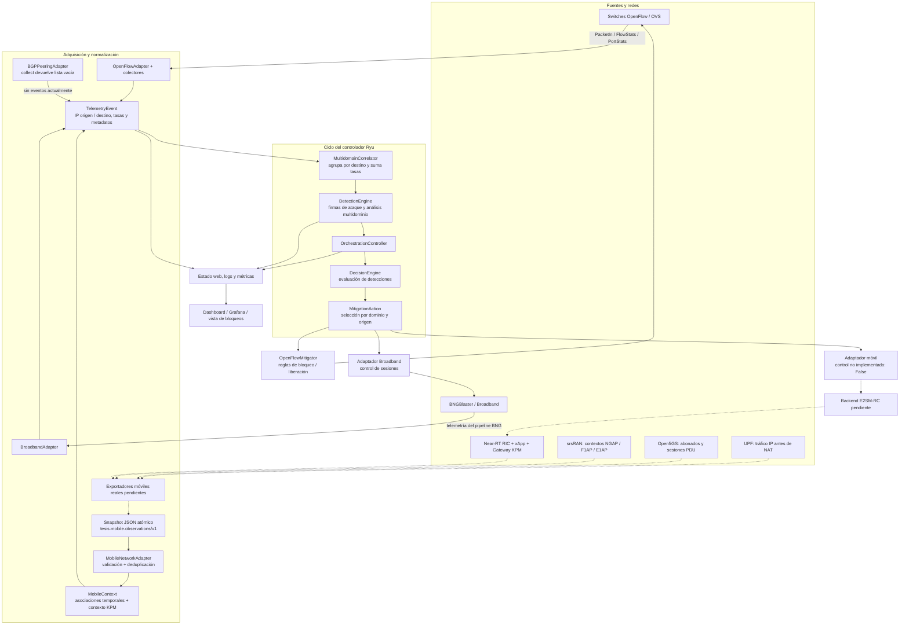
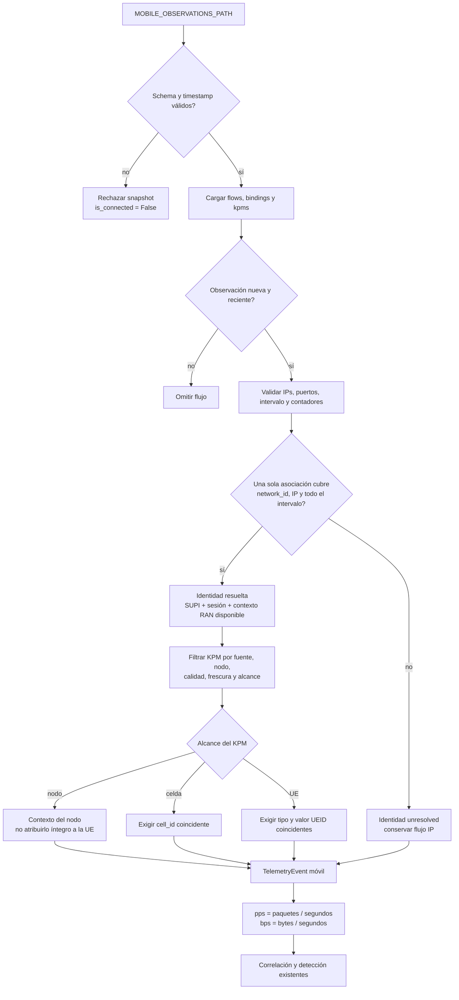
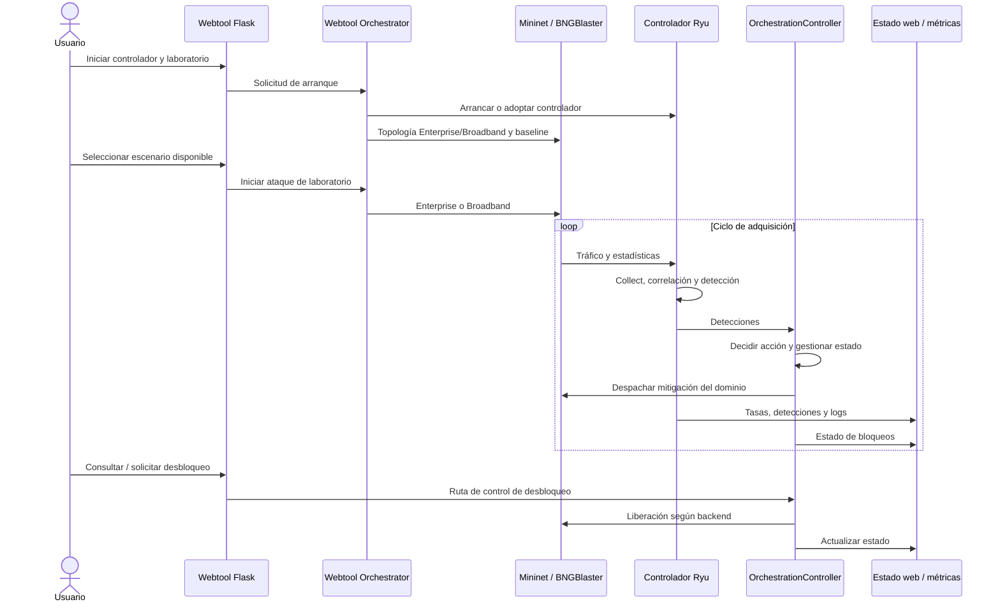

# Arquitectura y flujos de Tesis_Controller

Diagrama del código del repositorio después de retirar el simulador móvil/O-RAN.
Las líneas continuas representan conexiones implementadas; las discontinuas,
integraciones pendientes. Una conexión implementada no implica que su servicio
externo esté desplegado o validado en el testbed.

## 1. Vista general

El controlador ejecuta la adquisición periódica en `_run_pipeline`. Los eventos
OpenFlow también nacen de las respuestas y notificaciones de los switches.
La detección low-and-slow usa además información de conexiones del adaptador
OpenFlow; no depende únicamente de la suma de volumen por destino.

## 2. Flujo móvil y atribución por UE

- Los contadores deben ser incrementos de un intervalo, no acumulados.
- KPM se adjunta en `flags.kpm_context`; no genera otro flujo ni suma volumen.
- `flags.ue_session` conserva la identidad resuelta. Los modelos de detección y
  las vistas todavía no exponen todos estos campos como entidades dedicadas.
- El estado conectado indica que el snapshot pasó la validación, no que se haya
  verificado la salud de Open5GS, del gNB o del RIC.
- Un flujo sin identidad inequívoca puede detectarse por IP; no habilita atribución
  ni mitigación individual de UE.
- El productor debe evitar duplicados entre puntos de observación. El correlador
  global aún suma todos los eventos: observar el mismo tráfico en UPF y OVS puede
  duplicar el volumen si ambos se habilitan sin una política de propiedad.

## 3. Operación de la webtool

La webtool ya no crea gNBs ni UEs móviles simuladas. La entrada móvil real se
configura por entorno en el controlador y no depende del arranque de Mininet.
El diagrama de secuencia representa interacciones lógicas; la API/estado web
actúa como intermediario entre la webtool y la orquestación del controlador.

## 4. Límite importante del control móvil

El adaptador móvil devuelve `False` al solicitar mitigación. Sin embargo, la
orquestación heredada todavía registra un bloqueo móvil y devuelve éxito sin
propagar ese resultado (`orchestration/controller.py`, `_dispatch`). Por tanto,
**un bloqueo mostrado en la interfaz no demuestra una acción aplicada en la RAN**.
Esta inconsistencia debe corregirse antes de validar mitigación móvil de extremo
a extremo. Las rutinas heredadas de desbloqueo móvil tampoco constituyen una
confirmación E2SM-RC.

## 5. Mapa del código

| Responsabilidad | Archivo |
|---|---|
| Eventos OpenFlow y ciclo principal | `controller/ryu_controller_2.py` |
| Contrato de eventos comunes | `core/models.py` |
| Flujos, KPM y asociaciones móviles | `core/mobile_models.py` |
| Entrada de snapshots móviles | `telemetry/mobile_adapter.py` |
| Unión temporal y contexto radio | `correlation/mobile_context.py` |
| Agregación multidominio | `correlation/correlator.py` |
| Detección | `detection/engine.py` |
| Decisión | `decision/engine.py` |
| Despacho, estado y desbloqueos | `orchestration/controller.py` |
| Aplicación OpenFlow | `mitigation/openflow_mitigator.py` |
| UI y laboratorio | `webtool/app.py`, `webtool/orchestrator.py` |
| Métricas y estado | `web/metrics.py`, `web/state.py` |

Contrato y pasos pendientes: [Integración móvil](mobile-integration.md).
